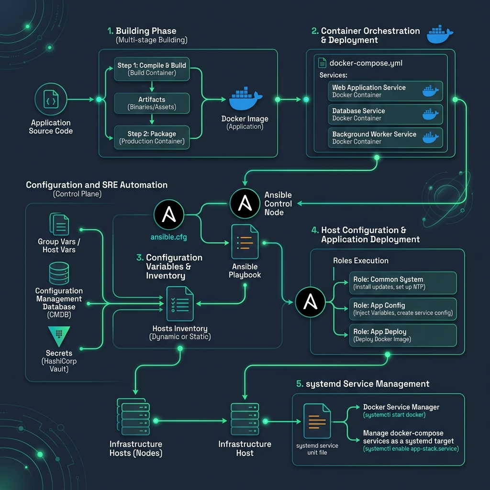

# 🗄️ GCP Cloud Spanner Studio
> Design globally distributed Cloud Spanner SQL schemas. Generate instance configurations, DDL database setups, and optimized database session pool limits.

[](https://pradeeptalari14.github.io/portfolio/tools/gcp-cloud-spanner/)
[]()

---

## 🎛️ How This Studio Works

Design globally distributed Cloud Spanner SQL schemas. Generate instance configurations, DDL database setups, and optimized database session pool limits.

Open the **[Interactive Studio](${studioUrl})** to configure options and generate files.
Each option combination produces different output — try different settings to learn by example.

## 🏗️ Architecture Flow Diagram



## 🚀 Step-by-Step Onboarding & Validation Guide

Follow these SRE steps to deploy, validate, and monitor this repository's workspace configs in a local or production environment:

#### 1. Prerequisites
- [x] **Docker Engine**
- [x] **Ansible 2.12+**
- [x] **Local SSH keys configured**

#### 2. Download
Clone this repository locally:
```bash
git clone https://github.com/Pradeeptalari14/tp-gcp-cloud-spanner.git
cd tp-gcp-cloud-spanner
```

#### 3. Install
Fetch required packages and compile environment binaries:
```bash
ansible-galaxy install -r requirements.yml || npm install
```

#### 4. Enable Automatic Sidecar Injection
Deploy helper logging sidecars (e.g. Logspout or Fluentbit) or daemon configs to track environment configurations.

#### 5. Install Kubernetes Gateway API CRDs
Set up local networking gateway adapters or gateway routing elements to map systems:
```bash
kubectl apply -f https://raw.githubusercontent.com/kubernetes-sigs/gateway-api/v1.1.0/config/crd/standard/gateway-api-v1.1.0-experimental.yaml
```

#### 6. Deploy Application Workload
Run Ansible playbooks or Docker Compose services:
```bash
# Start compose
docker compose up -d
# Or run playbook
ansible-playbook -i inventory/hosts.ini playbook.yml
```

#### 7. Validate Application Inside Cluster
Validate configurations validation scripts or compose states:
```bash
docker compose ps && ansible all -m ping -i inventory/hosts.ini
```

#### 8. Expose Application Using Gateway
Map application ports directly on host network interfaces:
```bash
curl http://localhost:8080
```

#### 9. Access the Application
Access services or target configuration logs on local port 8080 or mapped endpoints.

#### 10. Install Addons
Install Portainer container administrator dashboard, Ansible-vault tools, and docker-compose health watchers.

#### 11. Access Dashboard
Access localized portainer management consoles or system administration endpoints.

#### 12. View Service Mesh Graph
View compose service links networks or Ansible plays execution sequence hierarchy.

#### 13. Generate Traffic
Verify playbook configuration idempotency by repeating checks:
```bash
ansible-playbook -i inventory/hosts.ini playbook.yml --check --diff
```

#### 14. Project Structure
```text
tp-tp-gcp-cloud-spanner/
├── .gitignore                # Version control exclusions
├── LICENSE                   # MIT Open Source License
├── SECURITY.md               # Vulnerability reporting protocols
├── CHANGELOG.md              # Releases version history
├── README.md                 # Project learning guide & onboarding
├── .env.example              # Template parameters config
├── .pre-commit-config.yaml   # Gitleaks & lint pipeline hooks
├── docs/
│   ├── USAGE.md              # Extended developer usage docs
│   ├── TROUBLESHOOTING.md    # Failures resolution guide
│   ├── GLOSSARY.md           # SRE domain terminology index
│   ├── COMPLIANCE.md         # Legal and security checks checklist
│   └── sre_architecture_flow.png # Category SRE architecture diagram
├── scripts/
│   └── validate.sh           # Local validation helper script
└── .github/
    ├── CONTRIBUTING.md       # Contributing instructions
    ├── PULL_REQUEST_TEMPLATE.md # Pull request code compliance check
    ├── ISSUE_TEMPLATE/       # Bug and features tickets
    ├── dependabot.yml        # Auto updates dependencies
    └── workflows/
        └── security-scan.yml # Gitleaks/yamllint/shellcheck scans

# Primary Config File: spanner_ddl.sql
```

#### 15. Observability Components
Monitors task execution counts, container restart counters, file-system state drifts, and node memory levels.

#### 16. Install Monitoring
Sets up alerts for config drift flags, script exits failures, or system storage issues.

## 🔐 Security

- ❌ Never commit real credentials
- ✅ Use environment variables or secret managers
- ✅ Enable branch protection on `main`

## 📖 Resources

| Resource | Link |
|----------|------|
| Interactive Studio | [Open →](https://pradeeptalari14.github.io/portfolio/tools/gcp-cloud-spanner/) |
| All 91 Studios | [Dashboard →](https://pradeeptalari14.github.io/portfolio/tools/) |

*Part of [Talari Pradeep Developer Studio Portfolio](https://pradeeptalari14.github.io/portfolio)*